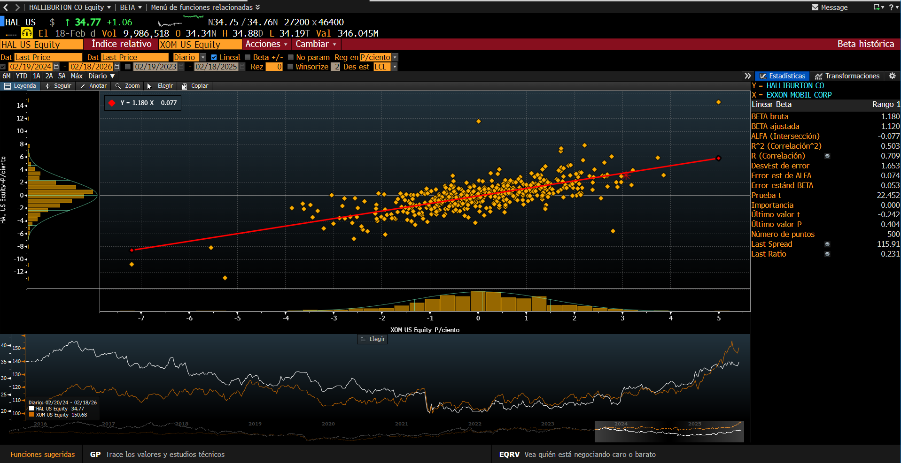
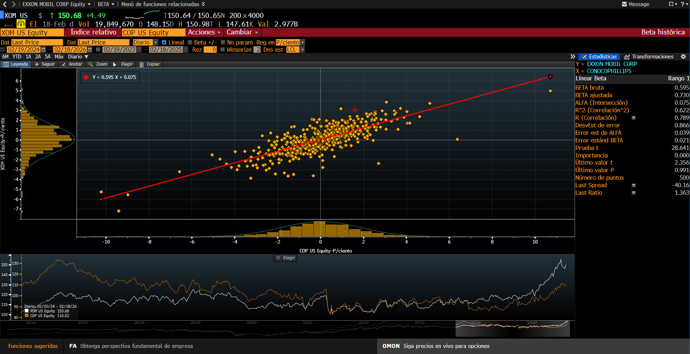
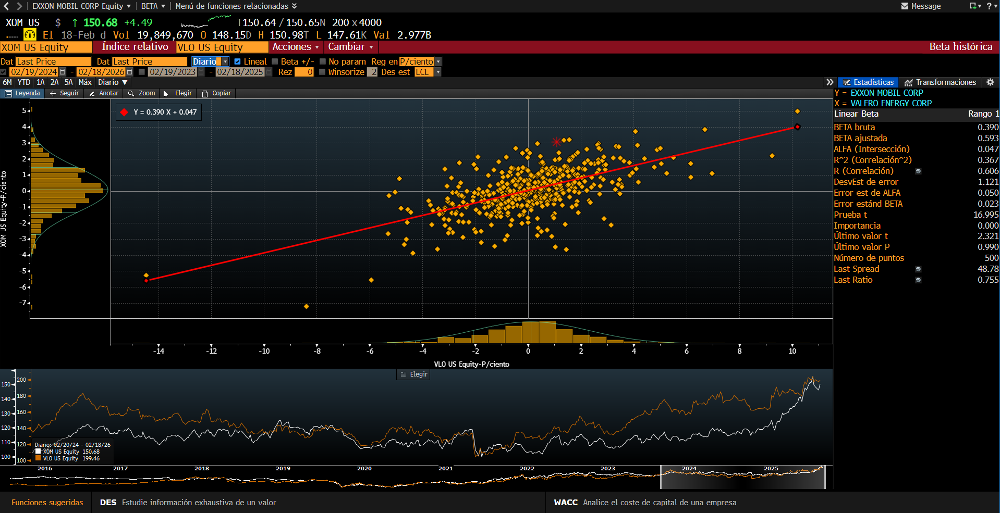
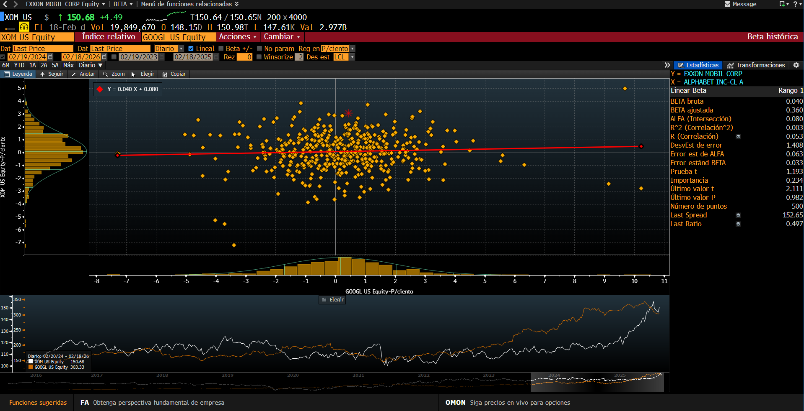

```{r setup, include=FALSE}
knitr::opts_chunk$set(echo = TRUE, warning = FALSE, message = FALSE)
```


```{r}
#Cargar Librerias

library(quantmod)
library(PerformanceAnalytics)
library(ggplot2)
library(dplyr)
library(ggcorrplot)
```

```{r}
#Descargar datos con getSymbols

# Tickers
tickers <- c("HAL", "XOM", "COP", "VLO", "GOOGL", "TSLA", "AMZN")

# Rango de fechas
from_date <- "2024-02-19"
to_date   <- "2026-02-18"

# Descargar datos
getSymbols(tickers,
           src  = "yahoo",
           from = from_date,
           to   = to_date)
```

```{r}
#Construcción de precios ajustados y rendimientos
#Bloomberg usa **returns**, no precios → usamos **log returns**.

# Precios ajustados
prices <- merge(Ad(HAL), Ad(XOM), Ad(COP), Ad(VLO), Ad(GOOGL), Ad(TSLA), Ad(AMZN))
colnames(prices) <- c("HAL", "XOM", "COP", "VLO", "GOOGL", "TSLA", "AMZN" )

# Eliminar NA
prices <- na.omit(prices)

# Rendimientos logarítmicos
returns <- na.omit(Return.calculate(prices, method = "log"))

head(returns)
```

```{r}
#Correlación lineal y Modelo lineal simple

correlation_HAL_XOM <- cor(returns$HAL, returns$XOM)
correlation_HAL_XOM

correlation_XOM_COP <- cor(returns$XOM, returns$COP)
correlation_XOM_COP

correlation_XOM_VLO <- cor(returns$XOM, returns$VLO)
correlation_XOM_VLO

correlation_XOM_GOOGL <- cor(returns$XOM, returns$GOOGL)
correlation_XOM_GOOGL

model_HAL_XOM <- lm(XOM ~ HAL, data = returns)
summary(model_HAL_XOM)

model_XOM_COP <- lm(XOM ~ COP, data = returns)
summary(model_XOM_COP)

model_XOM_VLO <- lm(XOM ~ VLO, data = returns)
summary(model_XOM_VLO)

model_XOM_GOOGL <- lm(XOM ~ GOOGL, data = returns)
summary(model_XOM_GOOGL)

```
```{r}
#Gráfica de Correlacion Lineal (tipo Bloomberg)

#HAL/XOM
ggplot(as.data.frame(returns),
       aes(x = XOM, y = HAL)) +
  geom_point(color = "gold", alpha = 0.8, size = 2) +
  geom_smooth(method = "lm",
              se = FALSE,
              color = "red",
              linewidth = 1) +
  labs(
    title = "HAL vs XOM – Linear Correlation",
    subtitle = "Log returns | 19-Feb-2024 to 18-Feb-2026",
    x = "XOM log returns",
    y = "HAL log returns"
  ) +
  theme_minimal()
#Insertar imagen Bloomberg

```

```{r}
#Gráfica de Correlacion Lineal (tipo Bloomberg)

#XOM/COP
ggplot(as.data.frame(returns),
       aes(x = COP, y = XOM)) +
  geom_point(color = "gold", alpha = 0.8, size = 2) +
  geom_smooth(method = "lm",
              se = FALSE,
              color = "red",
              linewidth = 1) +
  labs(
    title = "XOM vs COP – Linear Correlation",
    subtitle = "Log returns | 19-Feb-2024 to 18-Feb-2026",
    x = "COP log returns",
    y = "XOM log returns"
  ) +
  theme_minimal()

#Insertar imagen Bloomberg


```
```{r}
#Gráfica de Correlacion Lineal (tipo Bloomberg)

#XOM/VLO
ggplot(as.data.frame(returns),
       aes(x = VLO, y = XOM)) +
  geom_point(color = "gold", alpha = 0.8, size = 2) +
  geom_smooth(method = "lm",
              se = FALSE,
              color = "red",
              linewidth = 1) +
  labs(
    title = "XOM vs VLO – Linear Correlation",
    subtitle = "Log returns | 19-Feb-2024 to 18-Feb-2026",
    x = "VLO log returns",
    y = "XOM log returns"
  ) +
  theme_minimal()
#Insertar imagen Bloomberg

```


```{r}
#Gráfica de Correlacion Lineal (tipo Bloomberg)

#XOM/GOOGL
ggplot(as.data.frame(returns),
       aes(x = GOOGL, y = XOM)) +
  geom_point(color = "gold", alpha = 0.8, size = 2) +
  geom_smooth(method = "lm",
              se = FALSE,
              color = "red",
              linewidth = 1) +
  labs(
    title = "XOM vs GOOGL – Linear Correlation",
    subtitle = "Log returns | 19-Feb-2024 to 18-Feb-2026",
    x = "GOOGL log returns",
    y = "XOM log returns"
  ) +
  theme_minimal()

#Insertar imagen Bloomberg

```
```{r}
#matriz de correlacion
corr_matrix <- cor(returns)
round(corr_matrix, 3)
```

*Comparacion con Bloomberg*
```{r}
#Insertar imagen Bloomberg
knitr::include_graphics("Correlacion multiple.png")
```


```{r}
ggcorrplot(
  corr_matrix,
  method = "square",
  type   = "lower",
  lab    = TRUE,
  lab_size = 3,
  colors = c("#B2182B", "white", "#2166AC"),
  title  = "Correlation Matrix (Log Returns)",
  ggtheme = theme_minimal()
)
```


