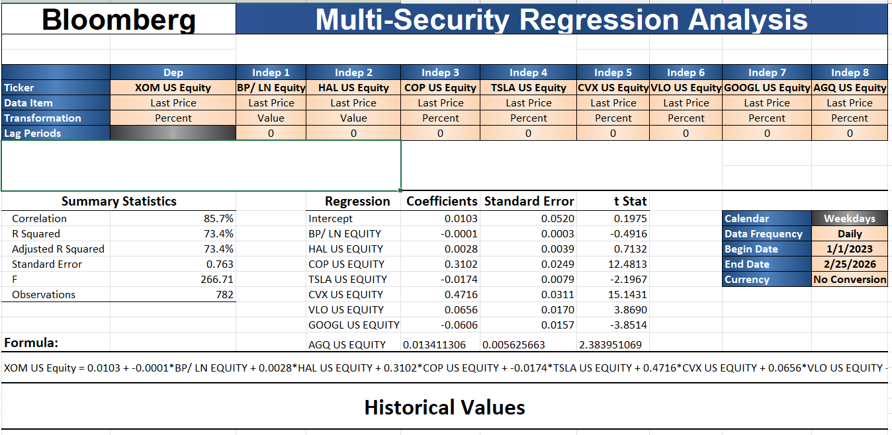
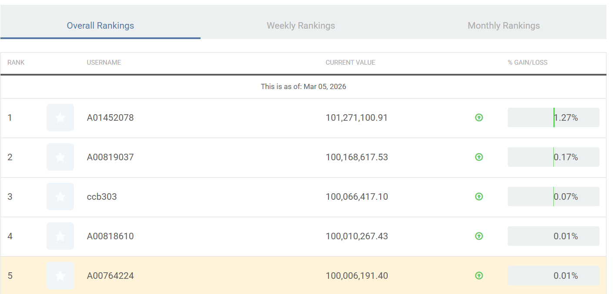
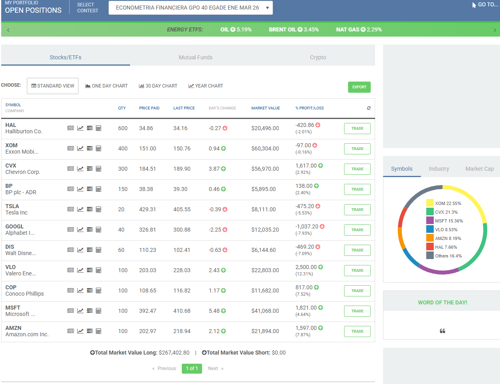
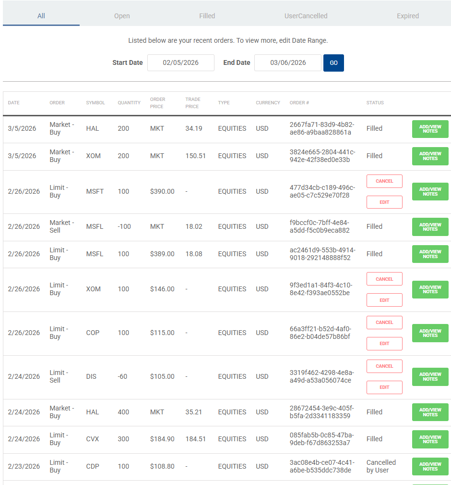

```{r setup, include=FALSE}
knitr::opts_chunk$set(echo = TRUE, warning = FALSE, message = FALSE)
```


```{r}
#Cargar Librerias

library(quantmod)
library(PerformanceAnalytics)
library(ggplot2)
library(dplyr)
library(ggcorrplot)
```

```{r}
#Descargar datos con getSymbols

#Tickers
tickers <- c("HAL", "XOM", "COP", "VLO", "GOOGL", "TSLA", "BP", "CVX", "AGQ")

# Rango de fechas
from_date <- "2023-01-01"
to_date   <- "2026-02-25"

# Descargar datos
getSymbols(tickers,
           src  = "yahoo",
           from = from_date,
           to   = to_date)
```

```{r}
#Construcción de precios ajustados y rendimientos
#Bloomberg usa **returns**, no precios → usamos **log returns**.

# Precios ajustados
#"HAL", "XOM", "COP", "VLO", "GOOGL", "TSLA", "BP", "CVX", "AGQ"


prices <- merge(Ad(HAL), Ad(XOM), Ad(COP), Ad(VLO), Ad(GOOGL), Ad(TSLA), Ad(BP), Ad(CVX), Ad(AGQ))

colnames(prices) <- c("HAL", "XOM", "COP", "VLO", "GOOGL", "TSLA", "BP", "CVX", "AGQ")

# Eliminar NA
prices <- na.omit(prices)

# Rendimientos logarítmicos
returns <- na.omit(Return.calculate(prices, method = "log"))

head(returns)
```

```{r}


# Convertir rendimientos a data.frame (NECESARIO para lm)
df_returns <- as.data.frame(returns)

# Verificar
head(df_returns)
str(df_returns)

# Modelo de regresión lineal múltiple
modelo_XOM <- lm( XOM ~ HAL + COP + VLO + GOOGL + TSLA + BP + CVX + AGQ,
  data = df_returns)

summary(modelo_XOM)
```

#Comparar los resultados de Bloomberg vs R




**Comparación conceptual (antes de números)**<br>
-Ambos modelos son comparables porque:<br>

Variable dependiente: XOM <br>
Variables independientes: mismo set de acciones<br>
Frecuencia: diaria<br>
Periodo: enero 2023 – febrero 2026<br>
Transformación: returns / percent changes<br>

**Diferencia clave:**<br>

Bloomberg: Percent returns <br>
R (getSymbols): log returns <br>
**Esto no invalida la comparación, solo cambia la escala.**<br>

Signos de los coeficientes:<br>

HAL: positivo en ambos modelos ✅
<br>COP: positivo y estadísticamente significativo ✅
<br>VLO: positivo y significativo ✅
<br>CVX: coeficiente positivo y dominante ✅
<br>TSLA: coeficiente negativo en ambos ✅
<br>GOOGL: coeficiente negativo ✅
<br>BP: efecto pequeño / mixto ✅
<br>AGQ: coeficiente positivo pero menor ✅


**Significancia estadística**
<br>
Bloomberg: t-stat altos para COP, CVX, VLO
<br>
R: p-values < 0.01 para HAL, COP, GOOGL, TSLA, BP, CVX

<br>


## Comparación de estadísticos: Bloomberg vs R

| Métrica     | Bloomberg | R (getSymbols) |
|------------|-----------|----------------|
| R²         | ~73%      | ~75.8%         |
| Adj. R²    | ~73%      | ~75.6%         |
| F-stat     | Alto      | 304.7          |
-------------------------------------------
<br>
**Coinciden en:**<br>
✅ variables energéticas explican XOM  <br>
✅ variables no energéticas tienen efecto menor o negativo  <br>
<p>
A partir del modelo estimado en R utilizando rendimientos logarítmicos obtenidos con `getSymbols`, se observa una alta consistencia en el signo de los coeficientes al compararlos con los resultados reportados por Bloomberg.
</p>
<p>
En ambos enfoques, las acciones del sector energético (**COP, CVX y VLO**) presentan coeficientes positivos, lo que confirma que los rendimientos de XOM están fuertemente influenciados por empresas comparables dentro del mismo sector. En particular, **CVX y COP** destacan como los factores con mayor impacto positivo en ambos modelos.</p>
<p>
Por otro lado, **TSLA** y **GOOGL** muestran coeficientes negativos en el modelo estimado en R, lo cual es consistente con los resultados observados en Bloomberg. Esto sugiere que los movimientos de estas acciones tecnológicas capturan factores de mercado distintos al sector energético y no se mueven en la misma dirección que XOM.
</p>

<p>
Las variables **HAL** y **BP** presentan coeficientes positivos, aunque de menor magnitud relativa, lo que es coherente con su rol dentro de la cadena de valor del sector energético. Finalmente, **AGQ**, al representar un ETF apalancado sobre plata, muestra un coeficiente positivo pero con menor relevancia económica directa.
</p>

**En conjunto, la coincidencia en los signos de los coeficientes entre Bloomberg y R valida la coherencia económica del modelo y respalda la robustez de los resultados obtenidos mediante datos de mercado abiertos.**<br>


**ANEXOS: **<br>
<p>
Las siguientes imagenes muestran las posiciones abiertas correspondientes a las acciones seleccionadas a partir del modelo de regresión lineal múltiple estimado para los rendimientos de XOM. El comportamiento observado en el portafolio es consistente con los resultados econométricos obtenidos tanto en Bloomberg como en R (getSymbols).</p>
<p>
En particular, las posiciones asociadas al sector energético —como CVX, COP, VLO, HAL y BP— presentan un desempeño positivo o estable, lo cual coincide con los coeficientes positivos y estadísticamente significativos estimados en el modelo. Estas empresas explican una parte sustancial de la variación en los rendimientos de XOM, lo que respalda la hipótesis de que los movimientos de ExxonMobil están fuertemente determinados por empresas comparables dentro del mismo sector. Asimismo, el modelo anticipaba una relación negativa o marginal con empresas fuera del sector energético, como TSLA y GOOGL, lo cual se refleja en un comportamiento más volátil y con menor contribución al rendimiento total del portafolio. Este resultado es coherente con la interpretación económica del modelo, ya que estas acciones capturan factores tecnológicos y de crecimiento que no están directamente alineados con la dinámica del mercado energético.</p>
<p>
La consistencia entre los signos de los coeficientes, la significancia estadística, y el desempeño real de las posiciones abiertas proporciona evidencia empírica adicional de que el modelo tiene capacidad explicativa y predictiva en el corto plazo. En conjunto, los resultados observados en el portafolio validan la estrategia de selección de activos basada en el modelo econométrico y refuerzan su coherencia económica.</p>


<br>
<br>
<br>


